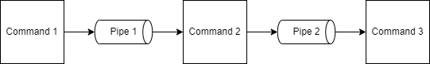
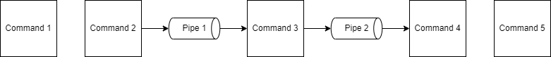

## Introduction

In a previous assignment, you worked with a shell program that allows a user to execute one or more command in sequence.

In this assignment, you will be extending the functionality of that shell to use inter-process communication mechanism (i.e. pipes) to add one important feature to your shell.

Work on the assignment is to be done ***individually***.  You are welcome to collaborate with class members, but the project must be your own work.

## Background and References

There are many shells available for Linux, arguably the most popular is 'bash' which stands for the Bourne-Again SHell.  The shell you will be developing for this assignment will work similarly to 'bash' but will have fewer features.  For more information about the 'bash' shell, you can check out the Wikipedia page:  [https://en.wikipedia.org/wiki/Bash_(Unix_shell)](https://en.wikipedia.org/wiki/Bash_(Unix_shell))

For a previous assignment, you used the ```fork()``` system call to create child processes, then used ```exec()``` to run the commands specified by the user, finally waiting for the commands to finish executing using the ```wait()``` system call.

For this assignment, you will be adding pipe support.  Using the pipe character '|' allows, the output from one command to be sent input to the next command in the sequence.  For example:

```text
$> ls | grep file
```

This command string executes the ```ls``` command which lists the contents of the current working directory and sends the output to the ```grep``` command which filters input based on a query, ```file``` in this case.   In short, the entire command string filters the ```ls``` output to show only entries that contain the name ```file```.

More information on shell pipes can be found here:
- The Linux Development Project - Bash Documentation: [https://tldp.org/HOWTO/Bash-Prog-Intro-HOWTO-4.html](https://tldp.org/HOWTO/Bash-Prog-Intro-HOWTO-4.html)
- Tutorial on Pipes and Filters: [https://www.tutorialspoint.com/unix/unix-pipes-filters.htm](https://www.tutorialspoint.com/unix/unix-pipes-filters.htm)

## Project Description

When a process is executed, it is run within the context of its environment.  This environment consists of several values that can be set when the process is created.  For example:

- Effective user
- Current working directory
- Search paths
- etc.

In addition, a process has three standard file descriptors:

1. Standard input (stdin) - used for receiving input from the user
2. Standard output (stdout) - used to print output messages to the user
3. Standard error (stderr) - used to print error messages to the user

Input file descriptors are, by default set, to be from the keyboard and output file descriptors are, by default, set to the console.  However, this can be overwritten by the creator of the process.  Recall that when a program is executed the ```exec``` system call that the memory for the process is replaced with that of the new program.  However, open file descriptors persist after the process memory is replaced.  Using this, feature a process creator can override the standard file descriptors with any other prior to calling ```exec```.  This is how a shell implements pipes.  

1. Instead of using the keyboard and console output, the shell uses the ```pipe``` system call to create pipe file descriptors.
2. Sets stdout from one command to the write end of the pipe
3. Sets stdin of the next command to the read end of the pipe
4. The commands run as normal and when they read and write, the input and output 'automatically' comes from the previous command or to the next command.

This is sometimes called input/output 'chaining' where the output from one command is sent as input to the next.

This can be seen in the following:

```text
$> command1 | command2 | command3
```



1. Command 1 sends stdout to the write end of Pipe 1
2. Command 2 reads stdin from the read end of Pipe 1
3. Command 2 sends stdout to the write end of Pipe 2
4. Command 3 reads stdin from the read end of Pipe 2

#### Question - Why is this useful?
#### Answer - Here is an explanation of the example
One example is for searching through command output.  Suppose you have a directory that consists of lots of files.  Using the ```ls``` command can list those files but would produce lots of output.  For example:

```text
$> ls -l
total 616
-rw-r--r-- 1 user user   6 Feb  8 08:51 0.txt
-rw-r--r-- 1 user user   6 Feb  8 08:51 1.txt
-rw-r--r-- 1 user user   6 Feb  8 08:51 10.txt
-rw-r--r-- 1 user user   6 Feb  8 08:51 11.txt
-rw-r--r-- 1 user user   6 Feb  8 08:51 12.txt
-rw-r--r-- 1 user user   6 Feb  8 08:51 13.txt
-rw-r--r-- 1 user user   6 Feb  8 08:51 14.txt
-rw-r--r-- 1 user user   6 Feb  8 08:51 15.txt
-rw-r--r-- 1 user user   6 Feb  8 08:51 16.txt
-rw-r--r-- 1 user user   6 Feb  8 08:51 17.txt
-rw-r--r-- 1 user user   6 Feb  8 08:51 18.txt
-rw-r--r-- 1 user user   6 Feb  8 08:51 19.txt
-rw-r--r-- 1 user user   6 Feb  8 08:51 2.txt
.
.
.
```

What if you wanted to know if a file with the name ```a.txt``` exists in the directory?  You'd have to search through the output which might involve lots of scrolling.  Instead, you can use the ```grep``` command to filter the results.  The ```grep``` command takes input from standard input and filters it based on a search criteria.  There is an entire language build around how to build ```grep``` filters, but just specifying a string is the simplest approach.  Using pipes (```|```) you can send the output of ```ls``` into ```grep```.  For example:

```text
$> ls -l | grep a.txt
-rw-r--r-- 1 user user   6 Feb  8 08:51 a.txt
```

Now the output only shows the lines that contain ```a.txt```.

Your job for this assignment is to extend Teeny Tiny Shell (ttsh) to support pipes between commands ***WITHOUT*** breaking any of the existing features (e.g. command line arguments, consecutive commands, etc.).  You will use the same prompt as before.

Behaviorally, commands run with chained input/output with pipes are similar to those executed sequentially using the semicolon.  The only difference is the setup of the input and output.  When extending your shell to support pipes, you must also be able to support sequential commands using the semicolon.

For example:

```text
$> command1 ; command2 | command3 | command4 ; command5
```



1. Command 1:
   - reads stdin from the keyboard 
   - sends stdout to the console
2. Command 2:
   - reads stdin from the keyboard
   - sends stdout to the write end of Pipe 1
3. Command 3:
   - reads stdin from the read end of Pipe 1
   - sends stdout to the write end of Pipe 2
4. Command 4:
   - reads stdin from the read end of Pipe 2
   - sends stdout to the console
5. Command 5:
   - reads stdin from the keyboard
   - sends stdout to the console

It might seem complicated, but just comes down to set up of the input and output for each process.  The kernel using ```pipe``` inter process communication, takes care of the rest.

### Using Pipe with STDIN and STDOUT

- Question: So using pipes, the output from one process can be 'sent' to the input of the next process.  However, the ```pipe()``` system call creates ***NEW*** file descriptors.  How do you change the file descriptors for stdin and stout so that they refer to the pipe file descriptors?
- Answer: Use the ```dup()``` system call.

The [```dup()```](https://man7.org/linux/man-pages/man2/dup.2.html) system call duplicates a file descriptor.  The ```dup2()``` system call is an extension of ```dup()``` that allows the caller to duplicate a file descriptor over an existing one.  Using this, you can replace a file descriptor with another.  For example:

```c
int my_pipe[2];
pipe(my_pipe);
dup2(my_pipe[0], STDIN_FILENO);
close(my_pipe[0]);
```

The above code:
1. Creates a pipe 
2. Duplicates the read end of the pipe over the top of stdin
3. Closes the read end of the pipe

Now, any read from stdin will come from the read end of the pipe.  Because the read end of the pipe is duplicated with ```dup2()```, it can safely be closed.

## Development Requirements

The following are existing development requirements from the previous TTSH assignment.  These requirements must still be fulfilled.

1. While most shells allow the user to customize the prompt, your shell will always use the following prompt string:
   
   ```text
   $> 
   ```
   
   A dollar sign ($), followed by a greater than (>), followed by a space ( )
2. Your ```ttsh``` must support up to 10 command line arguments for each command (separated by spaces)
3. Your ```ttsh``` must support up to 5 commands run sequentially (separated by semicolon)
4. While there many 'flavors' of the ```exec() ```system call, for this assignment you are required to use ```execvp()```.  See the man page for the specifics of how ```execvp()``` works.
5. Your shell must support a single internal command called 'quit' which stops the execution loop
6. You must use ```fork()``` and ```execvp()``` to create child processes and execute commands.  The use of the ```system()``` function is not allowed for this assignment.
7. Your ```ttsh``` must be free of memory leaks and segmentation faults.
8. Your ```ttsh``` only needs to support a max user input of 256 characters.

Additional requirements for TTSH with command 'pipes':

1. Your ```ttsh``` must support up to 5 commands run sequentially with redirected input and output (separated by the pipe character - '|')
2. Your ```ttsh``` must support a mixture of commands run sequentially with semicolons (without input/output chaining) and pipes (with input/output chaining).
3. Some shells allow for input and output redirection to a file using the '<' and/or '>' character.  Your TTSH does ***NOT*** need to support file redirection.
4. All processes ***MUST*** close unneeded ends of pipes 
5. Your ```ttsh``` must ***NOT*** redirect stderr for any child process.

### Code Structure

Code must follow style guidelines as defined in the course material.

## Getting Started

The following files have been provided for you in your repository:

- [src/ttsh.c](src/ttsh.c) - Contains the program entry procedure and logic for the shell
  - This file is empty and contains only the function definition for ```main``` as well as the inclusion of some header files.
  - The intent is to build in the features into your existing ```ttsh``` solution

At the top of ***EACH SOURCE FILE*** include a comment block with your name, assignment name, and section number.

***SUBMISSION REQUIREMENTS:***
- Feel free to create separate files for data structures and common use functions.  Use header files as needed.  Do ***NOT*** forget to use include guards in your header files.
- You must submit with your source code a ```Makefile``` which can be used to build your program.  Your program must compile without error ***AND*** without warnings.  Your ```Makefile``` must create a single executable called ```ttsh```

## Sample Execution

Here is a sample output for an execution of ```ttsh```.

***NOTE:*** the first line and last line shows the prompt presented from ```bash``` prior to running ```ttsh```.

```text
user@pc:~$ ./ttsh
$> ls
Makefile  ttsh  ttsh.c  ttsh.o
$> ls -l
total 48
-rw-r--r-- 1 user user   277 Jun  6 14:19 Makefile
-rwxr-xr-x 1 user user 22072 Aug  8 12:31 ttsh
-rw-r--r-- 1 user user  7237 Aug  8 12:31 ttsh.c
-rw-r--r-- 1 user user 15888 Aug  8 12:31 ttsh.o
$> ls | grep Make
Makefile
$> echo Listing ttsh files ; ls | grep ttsh ; echo I found them
Listing ttsh files
ttsh
ttsh.c
ttsh.o
I found them
$> asdfasdfasdfasdf
asdfasdfasdfasdf: failed to execute command
$> quit
user@pc:~/$
```

## Hints and Tips

- You are given several functions to parse user input and break it into individual commands based on a 'splitting' character.  Use this function to your advantage.
- While commands connected via pipes are connected (e.g. the output from one is sent as the input to the next), sets of commands connected with semicolons are not connected.
- To ensure that all pipes exist until all processes have completed, have the parent (i.e. shell) process create all pipes for the children and then have each child close the ends of the pipes that are not needed.
- Open file descriptors persist after a ```fork()``` system call and each process maintains its own file descriptors.  Have the parent set up the pipes for all children and after the call to ```fork()``` the pipes will be open for the children and can be utilized *independently* of the parent and other children.

***NOTE:*** Make sure all processes close ***ALL*** unneeded pipes before continuing with their work. 

***NOTE:*** Children processes will block waiting for input on stdin.  If there is no data in a pipe, the child process will wait for it.  Creating ***ALL*** children can be created at once provided the input and output redirection is set up correctly.

Consider breaking up your handling of pipes in the following:

1. Parent processes parses input to retrieve chained commands
2. Parent create an ```n-1``` length array of pipes for ```n``` chained commands
3. Parent creates child processes with ```fork()```
4. Children set stdin and stdout to the correct ends of the pipes in the array
   - Child ```k``` needs to set stdin to the read end of pipe ```k-1```
   - Child ```k``` needs to set stdout to the write end of pipe ```k```
   - Child should use ```dup2()``` to overwrite stdin and stdout as needed
   - Child closes all pipe ends after the call to ```dup2()``` to remove extra resources
5. Children run ```execvp()``` to execute the command.  File descriptors for stdin and stdout will remain in place after the call to ```execvp()```
6. Parent closes all ends of all pipes
7. Parent waits for all children to complete

## Testing and Debugging

Make sure you test boundary cases and print appropriate error messages to the user as needed. For example, if the user attempts to execute a command with more than 10 command line arguments, print an error message to the user and wait for a new command (without executing the command).

### Debugging

See the course debugging tips for using ```gdb``` and ```valgrind``` to help with debugging.

Your program must be free of run-time errors and memory leaks.

## Deliverables

When you are ready to submit your assignment prepare your repository:

- Make sure your name, assignment name, and section number are contained in all files in your submission - in comment block of source file(s)
- Make sure you have completed all activities and answered all questions.
- Make sure you cite your sources for all research.
- Make sure your assignment code is commented thoroughly.
- Include in your submission, a set of suggestions for improvement and/or what you enjoyed about this assignment.
- Make sure all files are committed and pushed to the main branch of your repository.

***NOTE***: Do not forget to 'add', 'commit', and 'push' all new files and changes to your repository before submitting.

### Additional Submission Notes

If/when using resources from material outside what was presented in class (e.g., Google search, Stack Overflow, etc.) document the resource used in your submission.  Include exact URLs for web pages where appropriate.

NOTE: Sources that are not original research and/or unreliable sources are not to be used.  For example:

- Wikipedia is not a reliable source, nor does it present original research: [https://en.wikipedia.org/wiki/Wikipedia:Wikipedia_is_not_a_reliable_source](https://en.wikipedia.org/wiki/Wikipedia:Wikipedia_is_not_a_reliable_source)
- ChatGPT is not a reliable source: [https://thecodebytes.com/is-chatgpt-reliable-heres-why-its-not/](https://thecodebytes.com/is-chatgpt-reliable-heres-why-its-not/)

You should ensure that your program compiles without warnings (using -Wall) or errors prior to submitting.  Make sure your code is well documented (inline comments for complex code as well as comment blocks on functions).  Make sure you check your code against the style guidelines.

To submit, copy the URL for your repository and submit the link to Canvas.

## Grading Criteria

- (5 Points) Submitted files follow submission guidelines
    - Only the requested files were submitted
    - Files are contain name, assignment, section
    - Sources outside of course material are cited
- (5 Points) Suggestions
    - List of suggestions for improvement and/or what you enjoyed about this assignment
- (10 Points) Code standard
    - Code compiles without errors or warnings
    - Code is formatted and commented per the course coding standard
- (5 Points) Memory management
    - Code contains no memory leaks
- (75 Points) Instructor Tests - Implementation passes all instructor test cases